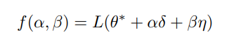
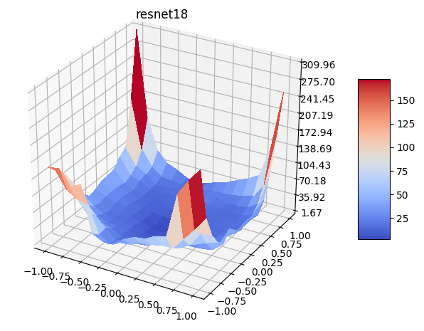
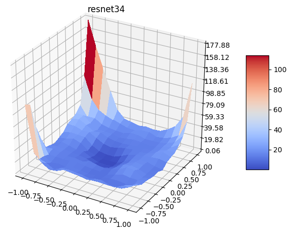
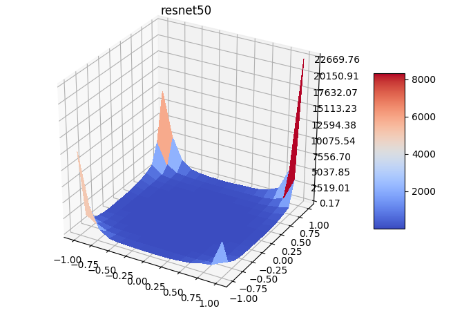
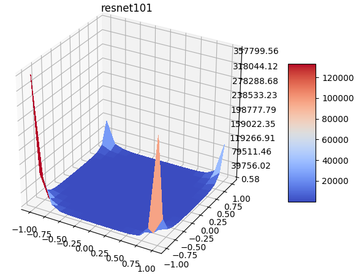

# surface visualization

Visualize the loss surface. This project is a shallow implementation of "Visualizing the Loss Landscape of Neural Nets."



direction vector is a random vector sampled from the normal distribution. The direction vector D is obtained as follows.

```python
direction = torch.randn(param.size()) * param
```

Bias and normalization were excluded from direction calculation (Set to 0)










